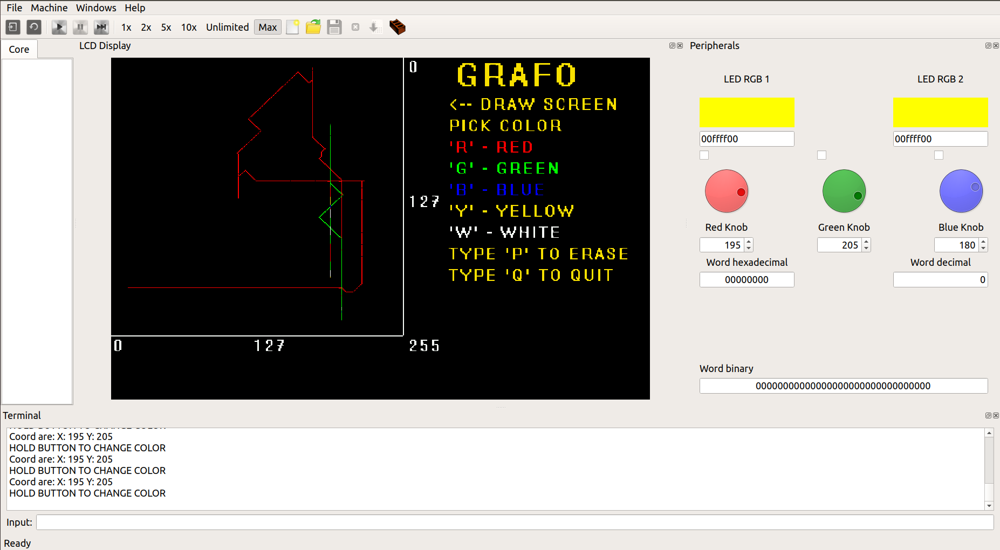

## GRAFO USER MANUAL
User manual for the game GRAFO.

# Installation
    1. Download the code:
    2. Install QTMips from this site: https://github.com/cvut/QtMips/releases/
    3. Set up your QTMips to see LCD Display, terminal with input, LED’s and knobs like the picture shows.
    

    4. Build the game using included Makefile.
    5. In your folder now should be ‘main’ file.
    6. Run that file in QTMips to start Grafo.
    7. Set QTMips speed to MAX.
	
    Note: For better performance, it is highly recommended to disable core-view, registers, program instructions and memory panels! Only terminal, peripherals and LCD Display panels are used.

# Controls
After you start the code, wait around half a minute before LCD loades. Keep an eye on the terminal. There will be instructions for you. After the LCD loads, you can start pressing some buttons to set color of your drawing.

# Color options – hold button:
    1. ‘r’ for color red
    2. ‘g’ for color green
    3. ‘b’ for color blue
    4. ‘y’ for color yellow
    5. ‘w’ for color white
    
* Hold ‘p’ for clear of draw field.
* Hold ‘q’ to end the game.
After you pick color, you will start drawing in the draw screen. Both LED’s will show you the chosen color.

* Changing color when drawing
    - hold the button for a moment for the code to pick it up.
    - or switch between colors using the blue knob - each color is available at different knob positions (knob value goes from 0 to 255):
        0 - 50: red
        51 -101: green
        102 - 152: blue
        153 - 203: yellow
        204 - 255: white
        
Note 1: At the start of the application, the blue knob is expected to be at position '0'. In case that is not true, the knob will override color selection from terminal and the initial color will be chosen based on the knob value.

Note 2: The program only executes a command if user holds a button for a very brief time period. The program will ignore a command when a button is pressed and then released immediately.

# Terminal
Terminal will show you every now and then coordinates of the cursor.
To change color when you start drawing, hold the button for a moment for the code to pick it up.

# Drawing
    * Use red and green knob to move the cursor
    
The drawing is controlled by red and green knob. Red knob value is horizontal coordinate of the cursor. Green knob value is vertical coordinate of the cursor. In the moment when you change some of the two values, the cursor will start to move for that new coordinate that you just set.  Line of the drawing will be continuous and whenever you change the values, it will move to new coordinate.
